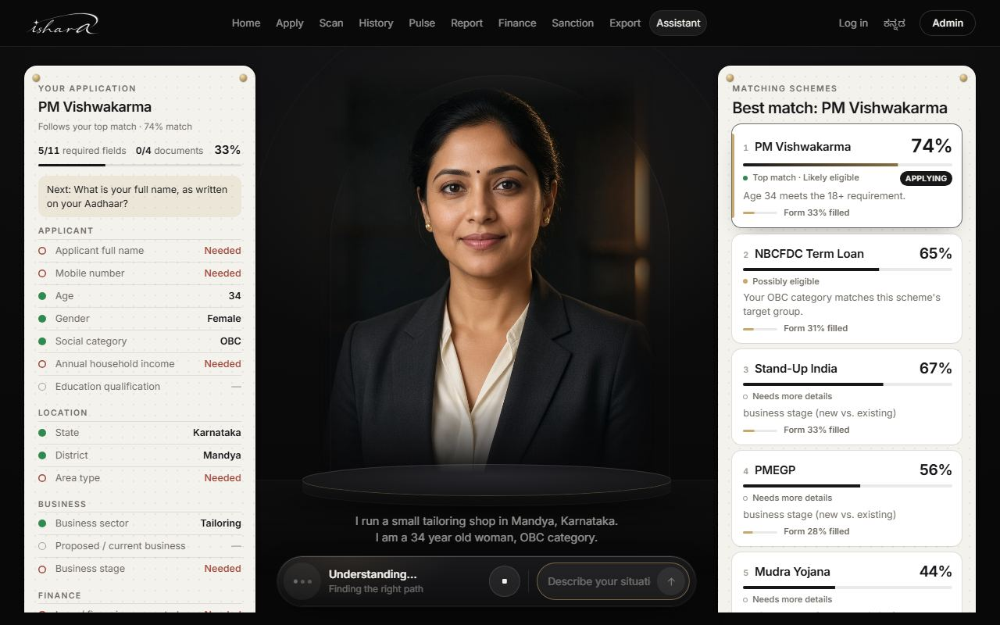
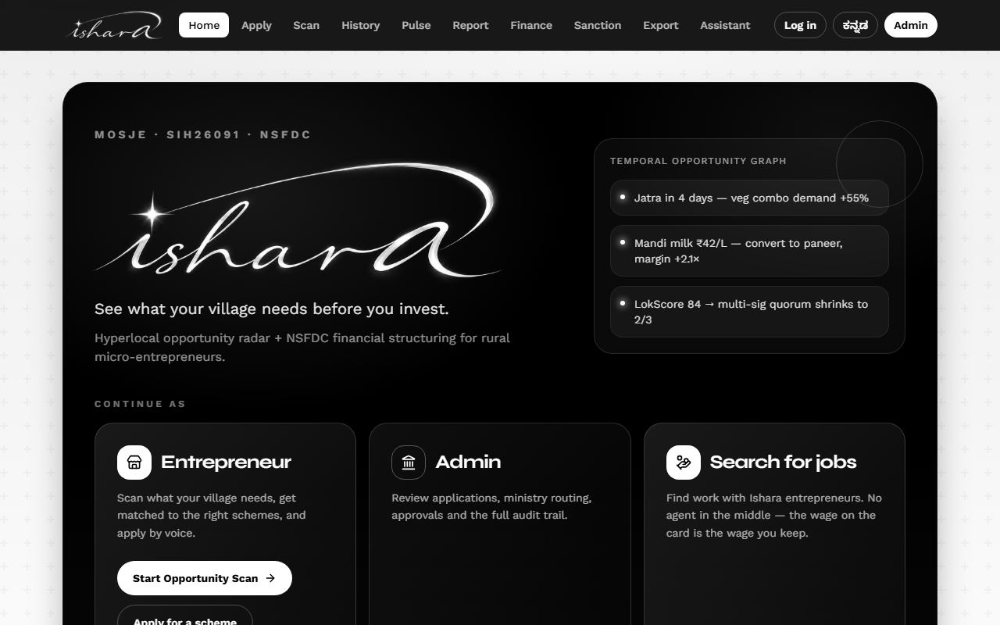
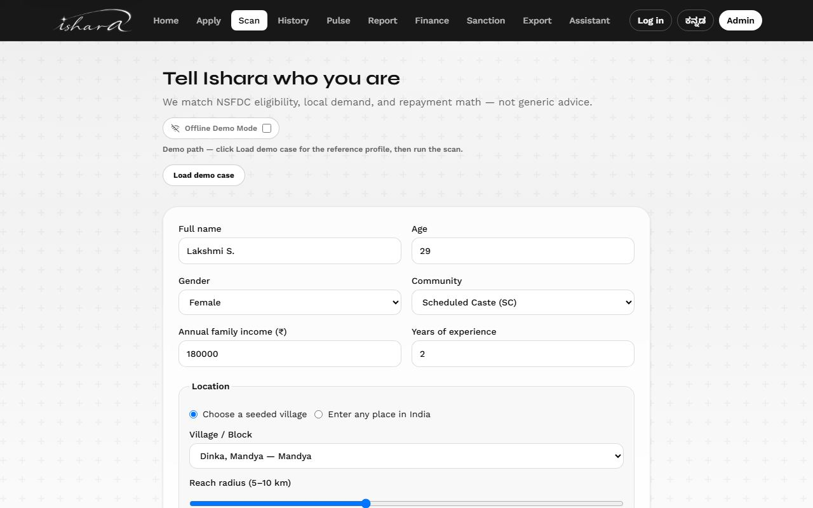
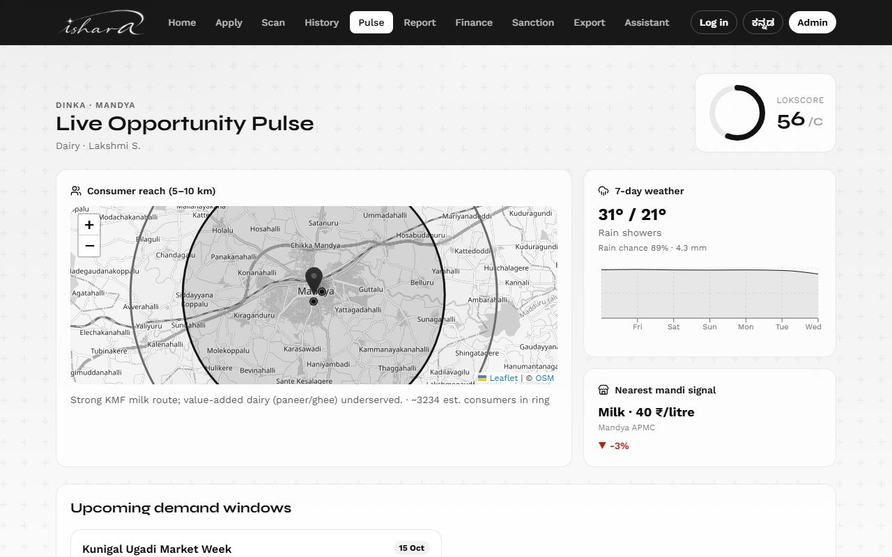
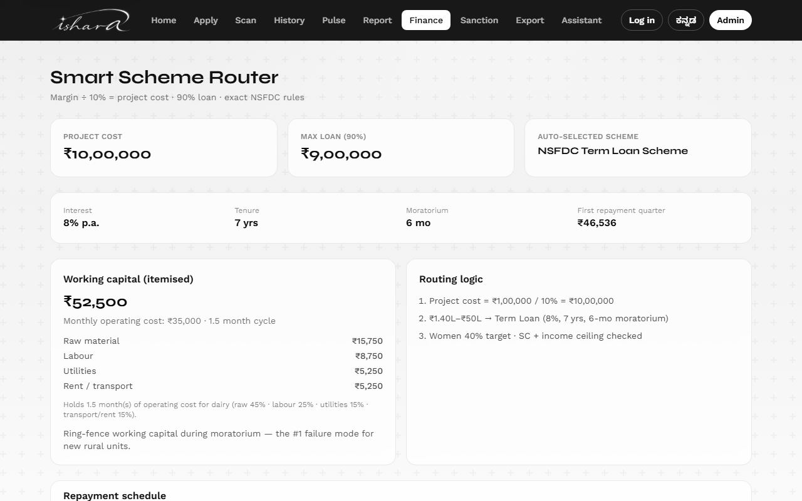
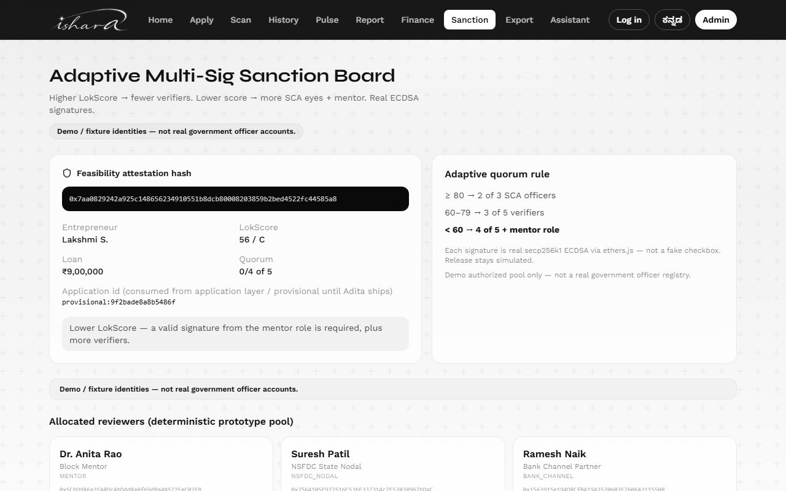
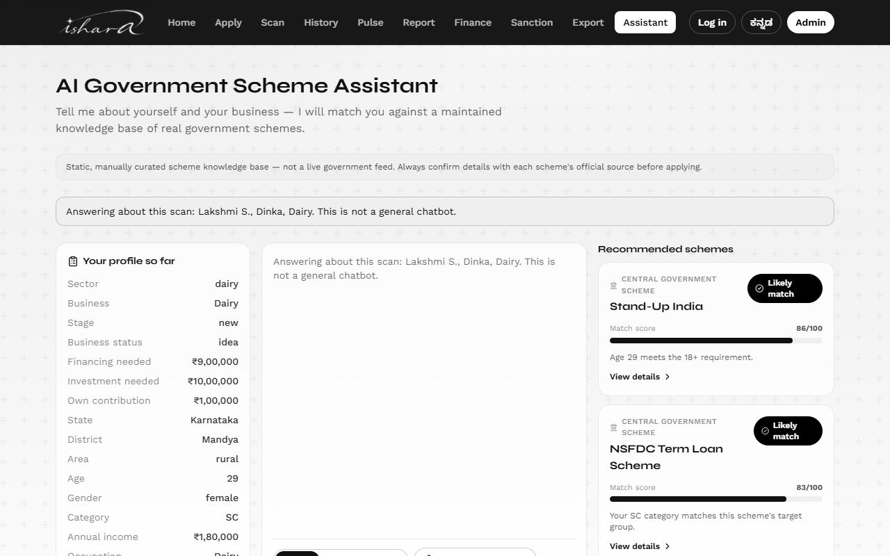
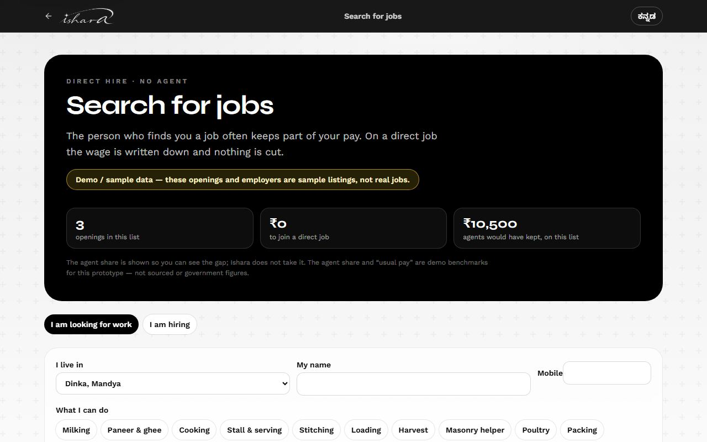
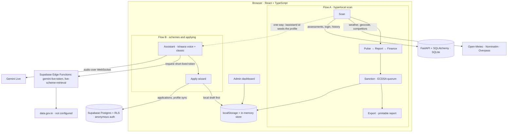

<!-- README last revised: 2026-10-01. Keep team roles, screenshots (docs/screenshots/) and "Recent changes" current; retake the screenshots when the UI changes. -->

<div align="center">

# Ishara

### See what your village needs before you invest.

A hyperlocal opportunity scan, exact NSFDC loan structuring, and a voice advisor that finds the right government scheme and fills in the application, for rural micro-entrepreneurs.

**ASYNC'26 · Open Track · team Trust The Process**


[Try it](#try-it-in-two-minutes) · [Screenshots](#screenshots) · [Architecture](#2-architecture--system-design) · [Setup](#3-installation--configuration) · [Known limitations](#5-reliability--known-limitations)



</div>

Originally **LokPulse**, built for SIH 2026 (problem statement SIH26091 · Ministry of Social Justice & Empowerment · NSFDC schemes); the codebase and API still use that name.
**Interface:** English + Kannada · **Voice:** English and Kannada on the Ishaara voice assistant; English, Kannada and Hindi on the classic assistant.

> **Maturity: hackathon prototype.** Parts of this app are real and tested end to end; other parts are built but not connected, or run only in the browser. [Reliability & Known Limitations](#5-reliability--known-limitations) lists which is which. [`docs/HONESTY_LEDGER.md`](docs/HONESTY_LEDGER.md) is the source of truth for every claim.

---

## 1. Context & Overview

### Elevator pitch

Ishara helps a rural micro-entrepreneur decide **what to start, where, and with how much money**, and then helps them **find and apply for the government schemes that fit**. A hyperlocal scan scores a business idea against local weather, competition and demand signals. An exact NSFDC loan calculator structures the finance. A cryptographically signed, score-driven approval quorum decides who must sign off. A scheme assistant (text or voice) matches the person against a curated set of real government schemes and walks them through an application.

### Try it in two minutes

With the app running ([Setup](#3-installation--configuration)), open `http://localhost:5173/home` in Chrome or Edge:

1. **Talk to the advisor.** Click **Assistant** in the top bar to open the Ishaara voice assistant. Click **Talk to Ishaara** and describe your business, or type, for example: *"I run a small tailoring shop in Mandya, Karnataka. I am a 34 year old woman, OBC category."* Matching schemes rank on the right while the application form fills in on the left.
2. **Scan a village.** Open `/scan?demo=1`, click **Load demo case**, then **Run hyperlocal scan**. Walk **Pulse → Report → Finance → Sanction → Export**. The demo case routes to the **NSFDC Term Loan Scheme**: a ₹10,00,000 project with a ₹9,00,000 loan.
3. **Ask about that scan.** In the scan's URL, replace `pulse` with `assistant` (`/assistant/<case-id>`). The classic assistant opens with that case's schemes already ranked.
4. **Find work.** Open `/jobs` for direct hiring without a middleman's cut. It runs on clearly labelled sample listings.

### Before and during ASYNC'26

ASYNC'26 began on **22 September 2026**. The dates below are commit dates from this repository's history.

**Before ASYNC'26** — LokPulse, built for SIH 2026 (SIH26091). All of this was already in the codebase before the hackathon began:
- The hyperlocal scan → Pulse → Finance → Sanction flow: LokScore computation, the NSFDC finance/EMI engine and live geo lookups (Nominatim/Overpass/Open-Meteo).
- An early text-only scheme assistant with rule-based profile extraction (12 Sep).
- The first Gemini Live voice foundation (16 Sep).
- The `/apply` guided wizard (16 Sep) and the `/apply/hub` application workflow (17 Sep).
- The first Supabase schema (17 Sep).
- The FastAPI persistence and login backend for the scan flow (20 Sep).

**During ASYNC'26 (22 Sep onward)** — this repo, Open Track, team Trust The Process. We took that existing foundation and made it real, tested and correct:
- **Voice:**
  - Deployed the voice token-minting function and proved its tokens are fresh and single-use.
  - Moved the assistant to native audio.
  - Fixed the Gemini Live WebSocket endpoint bug and the Blob/ArrayBuffer frame-decoding bug.
  - Added Kannada and Hindi voice modes.
- **Data isolation:** built real anonymous-auth row-level security and tested it with two real identities. One citizen cannot read or forge another's application or profile.
- **Profile extraction and `/apply`:** hardened profile extraction, and fixed `/apply` pre-filling placeholder demo data instead of what the citizen actually said.
- **Scheme data:** verified PM Vishwakarma against its official guidelines and expanded it to all 18 official trades. Added PMMSY (fisheries) from its operational guidelines.
- **Scan reliability:** Nominatim rate-limit compliance, telling rate limits, timeouts and missing places apart, and a 3-hour result cache.
- **Ishaara voice assistant and Jobs (30 Sep):** a full-screen voice advisor that fills in the application form as the citizen talks, and a Jobs page for direct hiring (sample data).
- **Tests:** about 490 new tests, roughly 760 → 1,248 declared tests (about 1.65×).

*Note:* this repository's commit history also includes contributions from the wider original LokPulse/SIH team, who are not part of the ASYNC'26 team roster below:
- Prerana Prakash — the FastAPI persistence/auth layer for the scan flow
- vamshikrishna21vk — the Supabase schema
- Aadita — the `/apply/hub` workflow

This section describes team roles for this hackathon's submission specifically, not full repository authorship.

### Problem statement

Rural enterprise failure is rarely just "no loan". More often it is **the wrong activity, the wrong timing, or the wrong loan structure**. Most tools stop at an eligibility checklist or a generic chatbot. Ishara tries to answer the whole question before money moves: *what should this person start, in this village, soon, with this margin money — and who must co-sign before disbursement?*

### Target audience

- **Rural micro-entrepreneurs**, especially applicants to NSFDC and similar central livelihood schemes. The built-in reference case is an SC woman in Dinka village (Mandya, Karnataka) starting a dairy unit with ₹1,00,000 of margin money.
- **Reviewing officers** who approve applications. The officer dashboard exists as a demo only; see [Known Limitations](#known-limitations).

### Core features

| Feature | What it does | Status |
|---|---|---|
| **Hyperlocal scan** (`/scan`) | Profile + location → live weather (Open-Meteo), live geocoding (Nominatim) and live competitor density (Overpass) for any Indian place; seeded mandi and festival signals for 5 curated Karnataka villages | Live APIs; seeded data where noted |
| **LokScore** | 0–100 score: demand 25%, competition gap 20%, weather fit 15%, financial coverage 25%, eligibility 15% (`src/lib/config.ts`) | Live, local computation |
| **NSFDC finance engine** | Exact scheme rules (table below), reducing-balance quarterly annuity EMI in integer paise | Live, locked by `src/lib/finance.test.ts` |
| **Adaptive sanction quorum** (`/sanction`) | LokScore ≥ 80 → 2-of-3 signers; ≥ 60 → 3-of-5; below 60 → 4-of-5 plus a mentor. Every signature is real secp256k1 ECDSA (`ethers`) | Real cryptography; stored in the browser only |
| **Report export** (`/export`) | One printable report (browser print → PDF) combining every screen plus a document checklist | Live |
| **Ishaara voice assistant** (`/assistant`, served from `/voice-assistant/`) | A full-screen voice advisor with an animated, AI-generated avatar. As the citizen talks or types, it ranks matching schemes and fills in the application form for the best match. It has its own Gemini Live session code and reuses the same scheme and eligibility engine. The **Assistant** link in the navigation opens it | Live, still being refined. Voice in English and Kannada (Hindi is on the classic assistant). Live connection verified end to end on 2026-10-01 with `scripts/voice-assistant-live-probe.mjs` |
| **Classic assistant** (`/assistant-classic`, and `/assistant/:id` for a scan case) | Chat-style text or voice. Plain-language description → deterministic profile extraction → deterministic eligibility ranking across 9 curated schemes → explanation. Every AI reply is validated against the evidence before it is shown (`src/assistant/ai/responseGuard.ts`). Opened for a scan case, it ranks that case's schemes on load | Live, runs in the browser |
| **Voice on the classic assistant** | Gemini Live native audio in English, Kannada or Hindi; the browser only ever holds a short-lived token minted by a Supabase Edge Function | Live; real-microphone use checked by hand, not by automated tests (see limitations) |
| **Jobs** (`/jobs`) | Employment matching between entrepreneurs who are hiring and workers looking for work, showing each wage with and without a middleman's cut | **Sample/demo listings only.** A worker's name and number are saved on this device; nothing reaches a real employer yet |
| **Guided application** (`/apply`) | Profile → scheme → documents → review → consent → submission, synced to Supabase under the citizen's own anonymous identity with row-level security | Live |
| **Officer dashboard** (`/admin`) | Applications table, detail, approval and audit views | Browser-only demo with demo login |

**NSFDC rules implemented** (`src/lib/config.ts`, `NSFDC`):

| Rule | Value |
|---|---|
| Project cost | margin money ÷ 10% |
| Loan | 90% of project cost |
| Micro Finance Scheme | project cost ≤ ₹1,40,000 · loan cap ₹1,25,000 · 6.5% p.a. · 3 years · 3-month moratorium |
| Term Loan Scheme | project cost ≤ ₹50,00,000 · loan cap ₹45,00,000 · 8% p.a. · 7 years · 6-month moratorium |
| Maximum margin money | ₹5,00,000 (larger amounts are rejected with a message, not silently clamped) |

**Schemes in the assistant's catalog** (`src/assistant/data/schemes.ts`, each with an official source URL and a last-verified date): NSFDC Micro Finance Scheme, NSFDC Term Loan Scheme, PMEGP, PM Mudra Yojana, Stand-Up India, PM Vishwakarma, NBCFDC Term Loan Scheme, Kudumbashree Microenterprise Support (Kerala), PMMSY (fisheries).

### Screenshots

Captured from the running app on 2026-10-01 (`docs/screenshots/`). The scan screens use the built-in demo case.

| | |
|---|---|
|  **Home** — start as an entrepreneur, an officer or a job seeker |  **Ishaara voice assistant** — schemes ranked, form filling in as you talk |
|  **Scan** — profile and village, with the demo case loaded |  **Pulse** — reach map, live weather, seeded mandi signal, LokScore |
|  **Finance** — ₹10,00,000 project → ₹9,00,000 NSFDC Term Loan, exact EMI |  **Sanction** — adaptive quorum, real ECDSA signatures, demo identities |
|  **Classic assistant for a scan case** — schemes ranked on load |  **Jobs** — direct hiring, labelled sample data |

---

## 2. Architecture & System Design

**Stack.** Frontend: React 19, TypeScript, Vite 8, Tailwind CSS 4, React Router 7, i18next, Leaflet, Recharts, ethers 6. Backend: FastAPI with SQLAlchemy and Alembic, on SQLite by default. Supabase: Postgres with row-level security, anonymous auth, and two Edge Functions.



### The two citizen flows

**Flow A — Scan → Pulse → Report → Finance → Sanction → Export.** Orchestrated by `src/state/AppContext.tsx`.
1. `/scan` collects the profile and a location: one of 5 curated villages, or any place geocoded live.
2. The scan resolves the location, fetches weather, competitor density and (for curated villages) mandi signals. It then builds the NSFDC finance plan and computes the LokScore.
3. It opens an approval case with real ECDSA signing, and saves the assessment to the **FastAPI** backend.
4. `/pulse/:id`, `/report/:id`, `/finance/:id`, `/sanction/:id` and `/export/:id` reload the assessment from FastAPI. If the server is unreachable, they fall back to a local snapshot.
5. `/login` (phone + OTP) and `/history` belong to this flow.

**Flow B — Assistant + guided Apply.** Built on `src/assistant/**` and `src/backend/**`, independent of Flow A's state and backend.
1. `/assistant` opens the **Ishaara voice assistant**, a separate Vite entry at `/voice-assistant/` (`voice-assistant/index.html`, `src/voiceAssistant/`) with its own voice session code. `/assistant-classic` is the earlier chat-style assistant, whose voice also supports Hindi. Both use the same deterministic ranking and eligibility engine (`rankScore = eligibility × 0.7 + relevance × 0.3`, `src/assistant/ranking.ts`).
2. `/apply` (guided wizard) and `/apply/hub` (structured `LP-APP-*` workflow) save a tracked application to `localStorage` first. They then sync it to **Supabase** under the citizen's anonymous identity.

**The one bridge between flows:** opening `/assistant/:id` for a completed scan seeds the classic assistant with that scan's profile (`src/assistant/fromAssessment.ts`). It is one-way and purely client-side, and it is reached by URL; the navigation's Assistant link opens the Ishaara voice assistant.

The assistant's internals — pipeline, AI providers, live retrieval and its trust model, Supabase setup, and the `/apply/hub` submission channels — are documented in [`docs/ASSISTANT.md`](docs/ASSISTANT.md).

### Three persistence paths — they do not interoperate yet

| Path | Used by | Identity |
|---|---|---|
| **FastAPI + SQLAlchemy** (`server/`, Alembic migrations) | Flow A: assessments, `/history`, `/login` | Phone + OTP (fixed demo OTP `123456`), real bearer token |
| **Supabase** (Postgres + RLS) | `/apply` applications, assistant profile sync, voice token and live-retrieval Edge Functions | Anonymous Supabase auth, one identity per browser |
| **localStorage / in-memory** (`src/platform/store.ts`, `src/lib/approval/*`, `src/admin/**`) | `/sanction` approvals, the whole `/admin` dashboard, the local application draft | None, or the demo admin login |

**Nothing links these today.** A citizen signed in through FastAPI and the same citizen's anonymous Supabase identity are unrelated as far as the code is concerned. The admin dashboard reads neither backend. Choosing which model becomes canonical is an open team decision ([`docs/handoffs/team-audit-2026-09-26.md`](docs/handoffs/team-audit-2026-09-26.md) §7).

### External services

| Service | Used for | State |
|---|---|---|
| Open-Meteo | Weather on `/scan` | Live, no key |
| Nominatim (OpenStreetMap) | Place search / geocoding | Live, no key; rate-limited to 1 request/second |
| Overpass (OpenStreetMap) | Nearby competitor density | Live, no key |
| Gemini Live | Voice assistant | Live; needs `GEMINI_API_KEY` as a Supabase secret |
| data.gov.in | Live scheme statistics | Wired end to end but **not configured** (no API key or dataset) |
| Ollama (local) | Optional local LLM for assistant explanations | Optional; the default is a deterministic offline provider |

---

## 3. Installation & Configuration

### Prerequisites

| Tool | Version |
|---|---|
| Node.js | `package.json` does not pin one. The tooling requires **Node 22.12+ or 24** (Vitest 5: `^22.12.0 \|\| ^24.0.0 \|\| >=26.0.0`; Vite 8: `^20.19.0 \|\| >=22.12.0`). Tested with Node 24.14.1 and npm 11.11.0. |
| Python | Not pinned in `server/`. Tested with **Python 3.12.10**. `server/requirements.txt` is unpinned. |
| Browser | Chrome or Edge for voice and for speech input on `/apply` |
| Optional | Supabase CLI (included as a dev dependency, run via `npx supabase`), Ollama |

The setup below is what the team has run all week, on Windows. macOS and Linux have not been tested; there the virtual-environment interpreter is `.venv/bin/python`.

### Frontend

```bash
git clone https://github.com/Kashif2310-bot/sih2026-local.git
cd sih2026-local
npm install
npm run dev
```

Open the URL Vite prints (usually `http://localhost:5173/`, or the next free port). Voice needs `.env.local` with the two `VITE_SUPABASE_*` values (see [Environment variables](#environment-variables)). After pulling new code, hard-refresh the browser (Ctrl+Shift+R) so no old cached code runs.

### Backend (FastAPI) — needed for Flow A persistence

```powershell
cd server
python -m venv .venv
.\.venv\Scripts\python.exe -m pip install -r requirements.txt
.\.venv\Scripts\python.exe -m alembic upgrade head
.\.venv\Scripts\python.exe -m uvicorn app.main:app --reload --port 8000
```

Health check: `http://127.0.0.1:8000/health` returns `{"status":"ok","db":"ok"}`. Without the backend, `/scan` still runs but assessments are only cached locally.

### Environment variables

Copy `.env.example` to `.env.local` and fill in only what you need. `.env.local` is git-ignored — **never commit it**. **No variable is required to start the app.** Flow B's Supabase sync and voice need the two `VITE_SUPABASE_*` values.

**Browser (`VITE_*` — bundled into the frontend, so never put a secret here)**

| Variable | Purpose |
|---|---|
| `VITE_API_URL` | FastAPI base URL. Defaults to `http://127.0.0.1:8000` |
| `VITE_SUPABASE_URL` | Supabase project URL |
| `VITE_SUPABASE_ANON_KEY` | Supabase anon/publishable key (public by design; access is enforced by RLS) |
| `VITE_GEMINI_LIVE_PROXY_URL` | Optional URL of a developer-run voice relay (an address, not a key) |
| `VITE_GOV_APPLY_API_URL` | Optional real government apply endpoint for `/apply/hub`. When unset, submission says "not configured" and nothing is filed. *Read by the code but not listed in `.env.example`.* |

**Server-side, integration tests, Supabase CLI (never prefix with `VITE_`)**

| Variable | Purpose |
|---|---|
| `SUPABASE_URL`, `SUPABASE_ANON_KEY`, `SUPABASE_PUBLISHABLE_KEY` | Supabase access for integration tests and scripts |
| `SUPABASE_SERVICE_ROLE_KEY`, `SUPABASE_SECRET_KEY` | Privileged keys, server and tests only |
| `SUPABASE_JWKS_URL` | JWKS endpoint for token verification |
| `SUPABASE_INTEGRATION` | `1` runs the hosted Supabase integration tests; default `0` skips them |
| `SUPABASE_ACCESS_TOKEN`, `SUPABASE_DB_PASSWORD` | Optional; for `supabase link` / `db push` to a hosted project |
| `DATABASE_URL` | FastAPI database (read by `server/app/config.py` from `server/.env`). Defaults to `sqlite:///./lokpulse.db` |

**Supabase Edge Function secrets** (set with `npx supabase secrets set NAME=...`, never in `.env.local`)

| Variable | Purpose |
|---|---|
| `GEMINI_API_KEY` | Used by `gemini-live-token` to mint short-lived voice tokens. Unset → voice reports unavailable (HTTP 503); text still works |
| `GEMINI_LIVE_MODEL` | Optional model override. Default `gemini-3.1-flash-live-preview` |
| `DATA_GOV_IN_API_KEY`, `DATA_GOV_IN_RESOURCE_ID` | data.gov.in access for `live-scheme-retrieval`. Currently unset |

**Backend-only discovery adapter** (`src/backend/services/officialSource/`, not reachable from the browser): `DATA_GOV_IN_API_KEY`, `DATA_GOV_IN_SCHEME_RESOURCE_ID`, `DATA_GOV_IN_BASE_URL`. These are separate from the Edge Function's variables; setting one set does not configure the other.

More detail: [`docs/ASSISTANT.md`](docs/ASSISTANT.md) (Supabase setup), [`docs/BACKEND_SETUP.md`](docs/BACKEND_SETUP.md), [`docs/BACKEND_INTEGRATION.md`](docs/BACKEND_INTEGRATION.md), [`docs/voice-session-architecture.md`](docs/voice-session-architecture.md).

---

## 4. Developer Experience

### Run a scan (UI)

1. Start the backend and `npm run dev` (see above).
2. Open `/scan?demo=1`, or open `/scan` and click **Load demo case**. This loads the fixed reference profile: Lakshmi S., 29, SC woman, Dinka village, dairy, ₹1,00,000 margin money.
3. Click **Run hyperlocal scan**, then walk **Pulse → Report → Finance → Sanction → Export**.
   - The expected finance result is project cost **₹10,00,000**, loan **₹9,00,000**, **NSFDC Term Loan Scheme**.
4. For unreliable venue Wi-Fi, switch on **Offline Demo Mode** on `/scan`. It uses the curated-village path and skips every live network call.

### Check the live voice connection (no browser needed)

```bash
node scripts/voice-assistant-live-probe.mjs "I run a small tailoring shop in Mandya, Karnataka."
```

It mints a token through the deployed `gemini-live-token` function, opens a real Gemini Live session, sends the sentence, and prints the reply and the resulting scheme ranking. Output from 2026-10-01, trimmed:

```text
token status 200
voice Sulafat
setupComplete after 1465 ms

user: I run a small tailoring shop in Mandya, Karnataka.
assistant (18.8 s audio): …
ranking now: …
```

A token status other than 200 means `.env.local` is missing or holds the wrong Supabase values.

### Call the assistant pipeline (TypeScript)

The matching pipeline is plain, deterministic TypeScript with no network calls:

```ts
import { EMPTY_PROFILE } from './src/assistant/types'
import { extractAndMerge } from './src/assistant/profileExtraction'
import { rankSchemes } from './src/assistant/ranking'

const { profile } = extractAndMerge(
  'I am a 32 year old SC woman from a village in Karnataka and I want to start a dairy business',
  EMPTY_PROFILE,
)
for (const r of rankSchemes(profile).slice(0, 3)) {
  console.log(r.scheme.name, '|', r.eligibility.status, '|', r.rankScore)
}
```

Actual output (re-run at commit `12c3ab3`):

```text
Stand-Up India | likely_eligible | 83
Prime Minister's Employment Generation Programme (PMEGP) | likely_eligible | 67
Pradhan Mantri Mudra Yojana (PMMY) | possibly_eligible | 57
```

The extracted profile was: age 32, female, rural, Karnataka, SC, dairy, new business at idea stage. Anything not clearly stated is left blank rather than guessed.

### Call the FastAPI backend

```bash
curl http://127.0.0.1:8000/health
# {"status":"ok","db":"ok"}

curl -X POST http://127.0.0.1:8000/auth/request-otp \
  -H "Content-Type: application/json" -d '{"phone":"9999999999"}'
# {"phone":"9999999999","code":"123456"}   ← demo OTP, the same for every number
```

`POST /auth/verify-otp` with `{"phone", "code"}` returns `{"user", "token"}`. Other endpoints: `POST /users`, `GET /users/{id}`, `GET /users/{id}/assessments`, `POST /assessments`, `GET /assessments/{id}`, `PATCH /assessments/{id}`. Interactive docs are at `http://127.0.0.1:8000/docs`.

### Test, lint, build

The full gate runs locally before every commit:

```bash
npx vitest run   # unit + component tests
npx tsc -b       # type-check
npm run lint     # oxlint --deny-warnings
npm run build    # tsc -b && vite build
```

Current results (commit `12c3ab3`, 2026-10-01):

| Command | Result |
|---|---|
| `npx vitest run` | **1,244 passed, 29 skipped**, 0 failed (132 files: 127 passed, 5 skipped) |
| `npx tsc -b` | No errors |
| `npm run lint` | No warnings or errors |
| `npm run build` | Succeeds |
| `server`: `.\.venv\Scripts\python.exe -m pytest -q` | **18 passed** (in-memory SQLite) |

- **Skipped tests:** the 29 skipped tests are exactly the 5 hosted-Supabase integration files. They run only with `SUPABASE_INTEGRATION=1` and real credentials.
- **End-to-end:** `npm run test:e2e` covers 36 Playwright tests in 9 files (`e2e/`). They were not run for this README, so there is no current pass count.
- **Not yet implemented:** continuous integration (the repo has no CI pipeline), a measured test-coverage report, and performance benchmarks.

---

## 5. Reliability & Known Limitations

**Current maturity: hackathon prototype — not production-ready.**

### What is built for reliability

- **Live calls fail fast:** every live lookup (geocoding, competitors, weather) times out after 2.5 s and retries once. If it still fails, it shows an honest "unavailable" or "incomplete" state rather than a fabricated value.
- **Incomplete scans are blocked:** an incomplete scan cannot be signed on `/sanction`.
- **Caching:** successful live lookups are reused for 3 hours and labelled as cached.
- **Server outages:** assessments survive a FastAPI outage via a local snapshot.
- **Voice outages:** if voice fails, the text assistant keeps working.
- **Secrets stay server-side:** no service-role, Gemini or data.gov.in key appears in the shipped bundle (verified by scanning `dist/`).
- **Row-level security:** Supabase RLS on applications and profiles is proven with two real, separate identities, not assumed from the policy text.

### Known limitations

Sourced from [`docs/HONESTY_LEDGER.md`](docs/HONESTY_LEDGER.md) and [`docs/handoffs/team-audit-2026-09-26.md`](docs/handoffs/team-audit-2026-09-26.md).

**Data and scheme knowledge**
- **data.gov.in live retrieval is not configured.** The Edge Function is deployed but returns `503 not_configured`, because no API key or dataset has been set. Every assistant reply is labelled as coming from the curated local dataset.
- **Scheme catalog:** 9 hand-curated schemes, not live government data. Each should be re-verified against its official source before relying on it. PMFME was considered and deliberately not added, because its approved period ends in September 2026.
- **Mandi prices are synthesized.** Values are generated from a seeded hash for the 5 curated villages (`src/lib/mandi.ts`), not taken from a live market feed. Places geocoded live get no mandi signal at all.
- **Festival demand comes from seeded templates** dated relative to today (`src/data/festivals.ts`), not a real event calendar.
- **Ranking order can look counterintuitive while key facts are still unknown.** This is in the shared ranking engine, so it affects both assistants.
  - **The rule:** the sort puts confidence tier before raw score, by design (`src/assistant/ranking.ts`, since 12 Sep). A scheme with two or more unchecked criteria drops to the "insufficient data" tier, however high it scores. The rule counts missing fields; it does not weigh how much each one gates eligibility.
  - **The effect:** a scheme missing only its deciding field can rank above a higher-scoring scheme that is missing two minor ones.
  - **Example (observed 1 Oct):** the profile gave state, district and sector, but no social category or age. The assistant named "NBCFDC Term Loan, 44%" as the top match, although NBCFDC is restricted to OBC applicants and the category was unknown. PM Vishwakarma scored 66% but was held back pending age and financing details.
  - **Workaround:** stating your age early avoids it here; PM Vishwakarma then leads at 74%. Stating a non-OBC category removes NBCFDC from the top.
  - **Fix:** weighting missing fields by how much they actually gate eligibility. Identified but not yet implemented.
- **Assistant explanations** come from a deterministic offline provider by default. A hosted-LLM path exists but is deliberately disabled until a server-side proxy exists.
- **Backend-only discovery adapter:** a second data.gov.in pipeline is built and tested on the backend but is not connected to the app.

**Identity, persistence and admin**
- **Three auth systems that don't interoperate:** FastAPI phone + OTP (the OTP is fixed at `123456`), Supabase anonymous auth, and a demo admin login.
- **The admin dashboard is a same-browser demo.** It reads and writes `localStorage` only, and its login accepts any non-empty password for one of 3 hardcoded demo identities. There is no real authentication.
- **Sanction approvals are stored in the browser only.** The ECDSA signatures and quorum rules are real, but approvals don't sync across devices or reach a real officer account.
- **Chain anchors and escrow release are simulated.** `contracts/AdaptiveSanction.sol` is not deployed.
- **Built but not connected:** a Supabase-backed approval service, admin queries and notification infrastructure are all tested but unreachable from any UI.
- **No document upload:** document tracking is metadata only; files are not stored anywhere.
- **The assistant's conversation profile lives in memory.** A hard refresh before it syncs can lose unsubmitted chat state.

**Voice and language**
- **Real-microphone voice is checked by hand only.** The team has used the classic assistant's voice in real spoken conversations (2026-09-30). Automated tests cover the connection and protocol against the real Gemini server, not real audio.
- **Intermittent voice start failure:** on 2026-09-30, starting a voice session failed with "Gemini Live connection closed unexpectedly: Internal error encountered". The part after the colon is the close reason Gemini sent. Scripted probes could not reproduce it, and the cause is not identified. The text assistant keeps working when this happens.
- **Kannada and Hindi voice:** automated tests verify the setup message (`kn-IN` / `hi-IN` plus an explicit reply-language instruction).
  - Spoken Hindi has not been re-checked with a real microphone since the Hindi mode was added.
  - Kannada has a manual real-audio checklist ([`docs/handoffs/manual-test-kannada-voice-2026-09-25.md`](docs/handoffs/manual-test-kannada-voice-2026-09-25.md)) with no recorded result.
  - Pinning a language may handle mixed-language speech worse than auto-detect.
- **Hindi is voice-only.** The interface is English and Kannada only (`src/i18n/index.ts`), and scheme content is English only.
- **The Ishaara voice assistant (`/assistant`)** has no Hindi mode; Hindi voice is on `/assistant-classic`. Its live connection is verified by the probe (2026-10-01), but no real-microphone session with it is recorded here yet. Its document matching still misfiles some PM Vishwakarma and PMMSY documents.
- **A scan's case assistant is reached by URL.** Nothing in the navigation links to `/assistant/:id`; the Assistant link opens the Ishaara voice assistant.
- **Profile extraction is English-only.** Hindi or Kannada speech or text leaves profile fields blank for the citizen to fill in, rather than guessed (`src/citizen/profileFormDraft.test.ts`).
- **No quota on voice tokens:** token minting has no per-user or per-IP rate limit. Anyone holding the public anon key can request tokens, so the Gemini key needs a spending cap on Google's side. Both assistants use the same token function.
- **Speech input on `/apply`** uses the browser's own speech recognition and works in Chrome and Edge. Other browsers show a clear message and fall back to typing.

**Jobs**
- **`/jobs` runs on sample data.** Every listing and employer is a built-in sample, labelled as such on the page. Wages, agent cuts and "usual pay" are demo benchmarks, not sourced figures. A worker's interest is stored in this browser's `localStorage` only.

---

## 6. Governance & License

### Team — Trust The Process (ASYNC'26)

| Member | Role in this submission |
|---|---|
| **Jordan Varghese** | AI voice assistant integration (Gemini Live), backend reliability engineering (scan caching, rate-limiting, failure handling), scheme data verification and sourcing, Supabase backend integration, testing discipline (full local gate before every commit) across the codebase |
| **Kashif** (Md Mujtaba Kashif) | Original voice assistant foundation and early scheme assistant; built the Ishaara voice assistant (`/assistant`) and the Jobs (`/jobs`) employment-matching feature during ASYNC'26 week |
| **Praneel** | *(role to confirm)* |
| **Harshvardhan** | *(role to confirm)* |

Contributors from the original LokPulse/SIH team are acknowledged under [Before and during ASYNC'26](#before-and-during-async26).

### License

Released under the [MIT License](LICENSE).

### Contributing

- Never push to `main` directly. Work on a branch, keep commits small and logical, push it, and open a pull request for review.
- Rollback points are tagged: `rollback/before-voice-assistant`, `rollback/before-assistant-route-fix`.
- Run the full gate (`npx vitest run && npx tsc -b && npm run lint && npm run build`) before every commit.
- Never commit `.env.local` or any key. Browser-bundled variables (`VITE_*`) must never hold a secret.
- Before claiming a capability in a demo, docs or a pitch, find its row in [`docs/HONESTY_LEDGER.md`](docs/HONESTY_LEDGER.md) and use its wording. Every new scheme figure must cite an official source.

**Further documentation:** [`docs/ASSISTANT.md`](docs/ASSISTANT.md), [`docs/DEMO_SCRIPT.md`](docs/DEMO_SCRIPT.md), [`docs/PRESENTATION_NOTES.md`](docs/PRESENTATION_NOTES.md), [`docs/MASTER_SPEC.md`](docs/MASTER_SPEC.md), [`docs/HONESTY_LEDGER.md`](docs/HONESTY_LEDGER.md), [`docs/handoffs/team-audit-2026-09-26.md`](docs/handoffs/team-audit-2026-09-26.md).

---

## Recent changes

Newest first. Add one dated line per revision instead of rewriting this file.

- **2026-10-01** — Polished for the hackathon: header, a two-minute demo path, and screenshots of the running app (`docs/screenshots/`). Wording now matches `/assistant` opening the Ishaara voice assistant. Added the live voice probe, and moved the test results and example output to `12c3ab3`.
- **2026-10-01** — `/assistant` and the Assistant link in the navigation open the Ishaara voice assistant again (project owner's decision). The previous assistant moved to `/assistant-classic`; a scan case's assistant stays at `/assistant/:id`.
- **2026-10-01** — Added the experimental `/voice-assistant/` page and the Jobs page (`/jobs`, sample data) after merging `feature/ishaara-voice-assistant`. `/assistant` stays the primary assistant.
- **2026-10-01** — README restructured for ASYNC'26. It now covers overview, architecture, setup, developer experience, known limitations and governance, and adds the before/during-ASYNC'26 history, the team section and the MIT license. The assistant deep-dive moved to [`docs/ASSISTANT.md`](docs/ASSISTANT.md). The honesty ledger was corrected for Hindi voice, real-microphone voice testing and the intermittent voice start failure.
